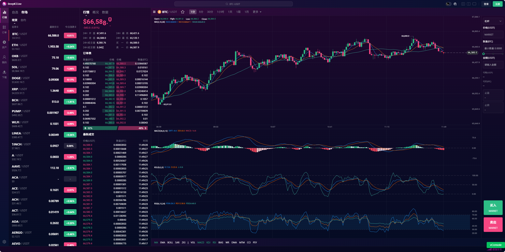
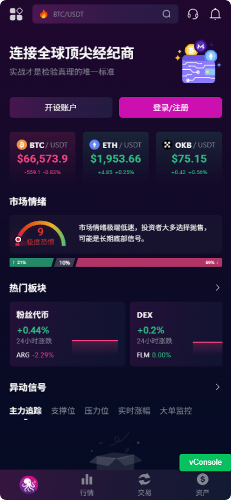

# Deepkline 深度视野，智能交易

### 基础环境
node20
nuxt3
tailwindcss
elementUI
capacitor


### 预览
https://dev.deepkline.com 
演示账号：dangfm@qq.com 密码 12345678

支持 web h5 pc android ios pwa

<video controls src="deepkline demo.mov" title="Title"></video>





### 打包
#### capacitor 打包安卓ios
```
"build:android": "cross-env MODE=android nuxt generate && npx cap sync android && npx cap open android",
"build:ios": "cross-env MODE=ios nuxt generate && npx cap sync ios && npx cap open ios"
```
#### electron 打包pc

```
"generate:win": "cross-env MODE=win nuxt generate",
"generate:mac": "cross-env MODE=mac nuxt generate",
```
需拷贝dist目录到electron的out/render目录